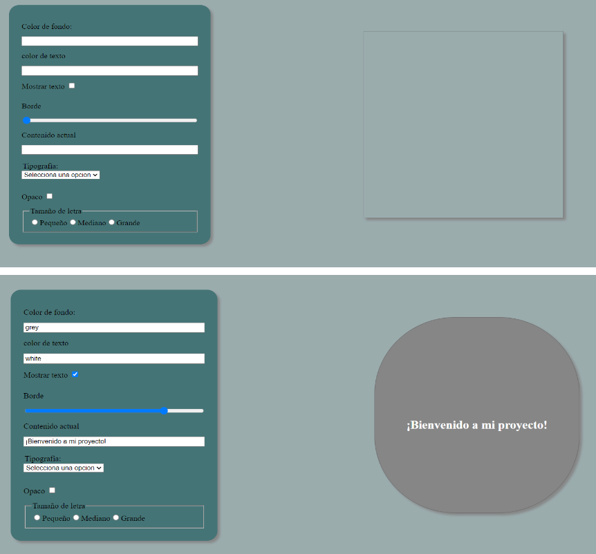

- [Templates y rendering en Vue](#templates-y-rendering-en-vue)
  - [Características](#características)
  - [Como usarlo](#como-usarlo)

Desarrolladora : Ana Celeste Pérez

# Templates y rendering en Vue
`Descripción:`  
Este proyecto es un formulario interactivo desarrollado con Vue.js que permite a los usuarios personalizar las propiedades de un cuadro dinámico. Los usuarios pueden cambiar el color de fondo, color del texto, opacidad, borde, tamaño del texto y tipografía.

## Características
`Puedes seleccionar:`  

🎨 Color de Fondo: Personaliza el color de fondo del cuadro dinámico.  

✏️ Color del Texto: Modifica el color del texto dentro del cuadro. 

👁️ Mostrar/Ocultar Texto: Alterna la visibilidad del texto. 

🖼️ Borde: Ajusta el radio del borde del cuadro dinámico.  

📝 Contenido Textual: Actualiza el contenido del texto dentro del cuadro. 

🔤 Tipografía: Selecciona entre varias opciones de tipografía. 

🌫️ Opacidad: Controla la opacidad del cuadro dinámico.  

🔠 Tamaño de Letra: Elige entre pequeño, mediano o grande para el tamaño del texto.  
## Como usarlo

`Color de Fondo:` Ingresa un color en formato hexadecimal, RGB o por nombre.

`Color del Texto:` Ingresa un color en formato hexadecimal, RGB o por nombre.

`Mostrar/Ocultar Texto:` Marca o desmarca la casilla para mostrar u ocultar el texto en el cuadro.

`Borde:` Ajusta el deslizador para cambiar el radio del borde del cuadro.

`Contenido Textual:` Escribe el texto que quieres mostrar en el cuadro.

`Tipografía:` Selecciona una tipografía del menú desplegable.

`Opacidad:` Marca la casilla para hacer el cuadro opaco.

`Tamaño de Letra:` Selecciona el tamaño del texto (pequeño, mediano, grande).

**NOTA**
Me falto adaptar el tamaño del cuadro interactivo cuando la letra seleccionada es "grande".